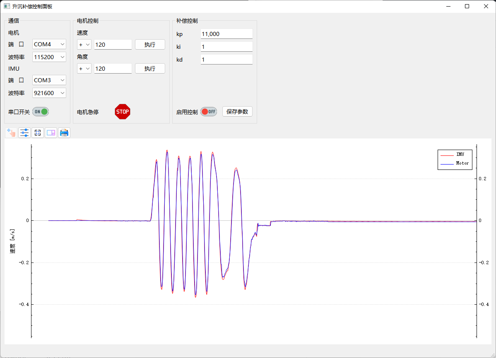
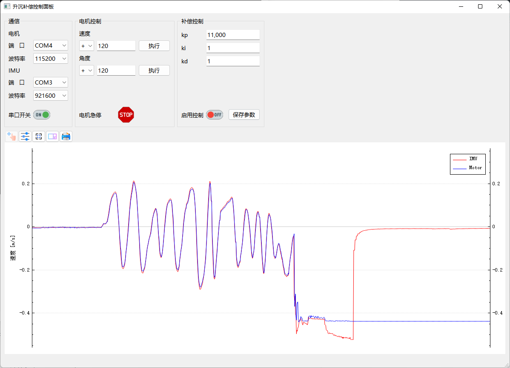
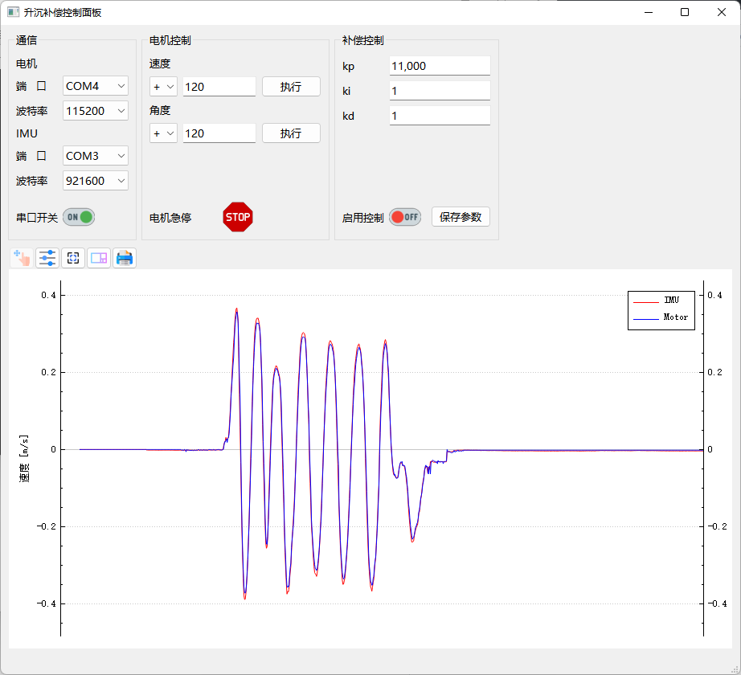

# 升沉补偿系统

#### 介绍
江苏科技大学---极地海洋装备研究所

升沉补偿系统

#### 软件架构
- 硬件：IMU、低速高扭伺服电机
- 软件：Qt widgets
- 算法：pid速度控制


#### 安装教程
1. download from release
2. unzip
3. just use

#### 依赖库
0. Qt
1. [QCustomplot](https://www.qcustomplot.com/) [(download)](https://www.qcustomplot.com/index.php/download)

#### 编译与开发
0. cd ~
1. git clone https://github.com/PilotPhil/HEAVE_COMPSATION_GUI.git
2. cd HEAVE_COMPSATION_GUI
3. modify qcustomplot dir by your install path in CMakeLists.txt
4. mkdir build
5. cd build
6. cmake ..
7. make -j16
8. ./HEAVE_COMPSATION_GUI


#### 启动图标设置
0. cd ~
1. cd HEAVE_COMPSATION_GUI/build
2. touch run.sh
   ```
    sudo chmod 666 /dev/ttyUSB0
    sudo chmod 666 /dev/ttyCH343USB0
    ./HEAVE_COMPENSATION
   ```
3. cd ~/Desktop
4. touch HEAVE_COMPSATION.desktop
    ```
    [Desktop Entry]
    Encoding=UTF-8
    Version=1.0
    Type=Application
    Name=heave control
    Path=/home/calajv/HEAVE_COMPSATION_GUI/build
    Exec=/home/calajv/HEAVE_COMPSATION_GUI/build/run.sh
    Icon=/home/calajv/HEAVE_COMPSATION_GUI-main/icons/control.png
    Categories=Application
    Terminal=false
    StartupWMClass=heave;
    ```
5. double click and run

#### 效果演示
- 视频
[演示(BiliBili)](https://www.bilibili.com/video/BV1xt4y1H7EQ?share_source=copy_web)
- 图片




#### 参与贡献
1. GUI框架实现：Pilot.Phil
2. 机械结构硬件部分：Liu、Ma等


